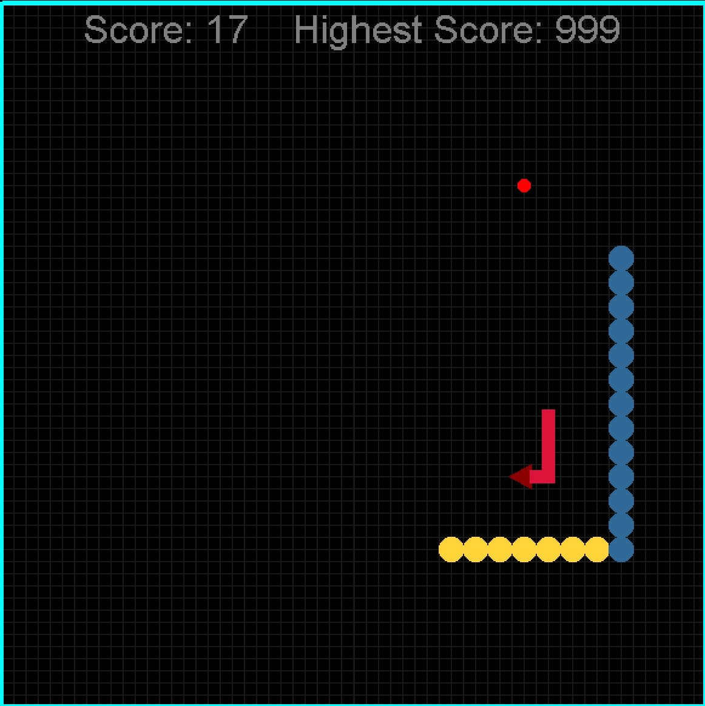
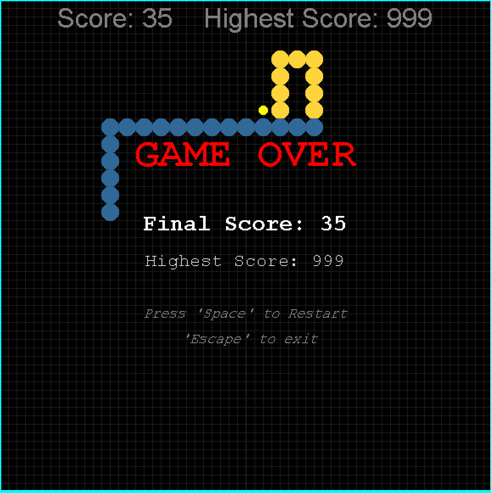

# 🐍 The Python Game

A classic Snake game built with Python's `turtle` module — but with a twist: special food abilities, a chasing enemy, and persistent high scores.




## ✨ Features

- **Classic snake movement** with grid-based borders
- **Special food types**, each with a different effect:
  - 🔴 Red — standard food, adds points
  - 🟢 Green — recovers lost body parts
  - 🔵 Blue — slows down the game pace
  - 🟡 Yellow — grants temporary invincibility

- **Enemy chaser** that spawns periodically and hunts the snake
- **Invincibility mode** — pass through walls (teleporting to the opposite side) and cut through the enemy safely
- **Persistent high score** — saved to a local file between sessions
- **Restart on death** — press `Space` to play again without relaunching

## 🎮 Controls

| Key       | Action                           |
| --------- | -------------------------------- |
| `↑ ↓ ← →` | Move the snake                   |
| `Space`   | Restart (after game over)        |
| `Esc`     | Quit (from the game over screen) |

## 🛠 Requirements

- Python 3.x
- `turtle` — included in the Python standard library, no installation needed

## ▶️ How to run

```bash
git clone https://github.com/Moath-Cs7/snake-game-extended-edition.git
cd snake-game-extended-edition
python main.py
```

## 🚀 Possible future improvements

- Difficulty levels (faster pace, more enemies)
- Sound effects
- On-screen ability indicator/timer
- Configurable screen size
- And cleaner code

## 📄 License

Feel free to use, modify, or learn from this project.

This is my first personal project as I learn Python — feedback and suggestions are very welcome! Feel free to open an issue or PR.
